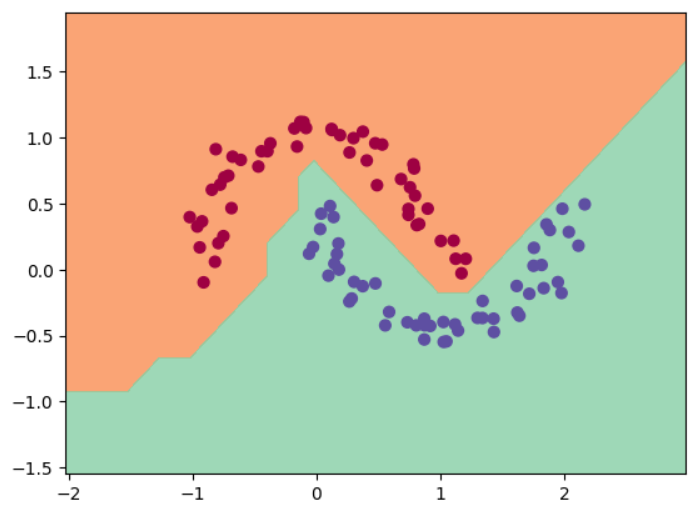
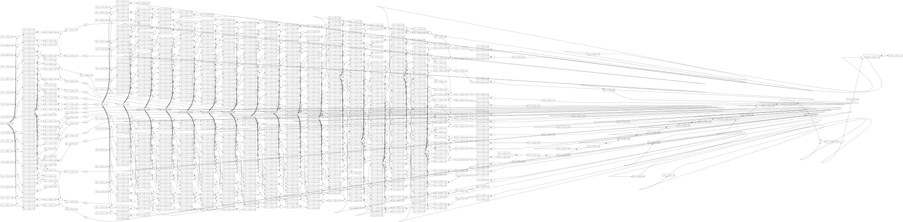

# Minigrad

Minigrad is a minimal automatic differentiation engine inspired by Andrej Karpathy's [micrograd](https://github.com/karpathy/micrograd). 

## Example features

Below is a snippet of some of the various supported operations:

```python
from minigrad.engine import Value

x = Value(3.0)
y = Value(-1.0)

# forward pass with a mix of ops
p = x * y
q = x + y + 2
r = (x - y).relu()
s = p + q * r
t = s**2
u = t / 2.0
u += 5.0 / (r + 1)

print(f"{u.data:.4f}")  # forward pass result

# backward pass
u.backward()
print(f"{x.grad:.4f}")  # gradient du/dx
print(f"{y.grad:.4f}")  # gradient du/dy

```

## Example usage

The demo notebook provides a test of training a 2-layer neural net (MLP) binary classifier on the well known two moons dataset.



## Computation graph 

To help visualize the models, there is a graphviz-based module for tracing out the computation graph of the neural nets produced.
Here is the graph of the MLP from above (the 2 hidden layers consist of 16 neurons each) and as you can see the graph can become quite large!



This project is designed to understand how backpropagation (reverse mode autodiff) and gradient descent work under the hood in modern deep learning frameworks like PyTorch.


